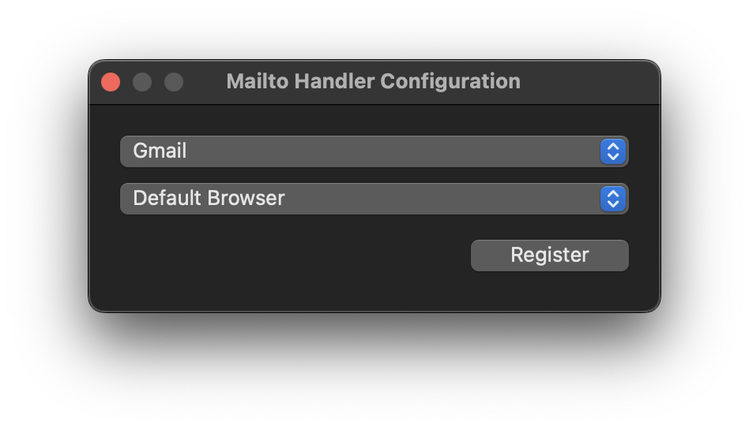

# MailtoHandler

[**Download MailtoHandler.dmg**](https://github.com/VoiceNGO/MailtoHandler/raw/main/MailtoHandler.dmg)

A simple app that captures mailto: links and redirects them to whatever webmail provider you use.



## Installation

1. Download and open `MailtoHandler.dmg`
2. Drag `MailtoHandler.app` to your Applications folder
3. **First launch only:** Right-click the app and select "Open", then click "Open" in the dialog
4. After the first launch, you can open it normally

**Why the right-click?** This app isn't code-signed because I'm not paying Apple $99/year to distribute a free utility. The right-click bypass is a one-time thing.

## Supported Email Providers

- Gmail
- Outlook.com
- Yahoo Mail
- ProtonMail
- iCloud Mail
- Zoho Mail
- AOL Mail
- GMX Mail
- Tutanota
- Mail.com
- Fastmail
- Hushmail
- Mailfence
- Runbox
- Neo
- Titan
- 10 Minute Mail

## Custom Handler

If you are using a webmail provider not listed, you can enter a custom compose URL. The following placeholders will be replaced with the appropriate values from the `mailto:` link:

- `{recipient}`
- `{subject}`
- `{cc}`
- `{bcc}`
- `{body}`

**Example (Gmail):**
```
https://mail.google.com/mail/?view=cm&to={recipient}&cc={cc}&bcc={bcc}&su={subject}&body={body}
```

Search for "**[your provider name] compose URL parameters**" to find the compose URL format for your email provider. Look for documentation on how to pre-fill compose fields via URL parameters.
